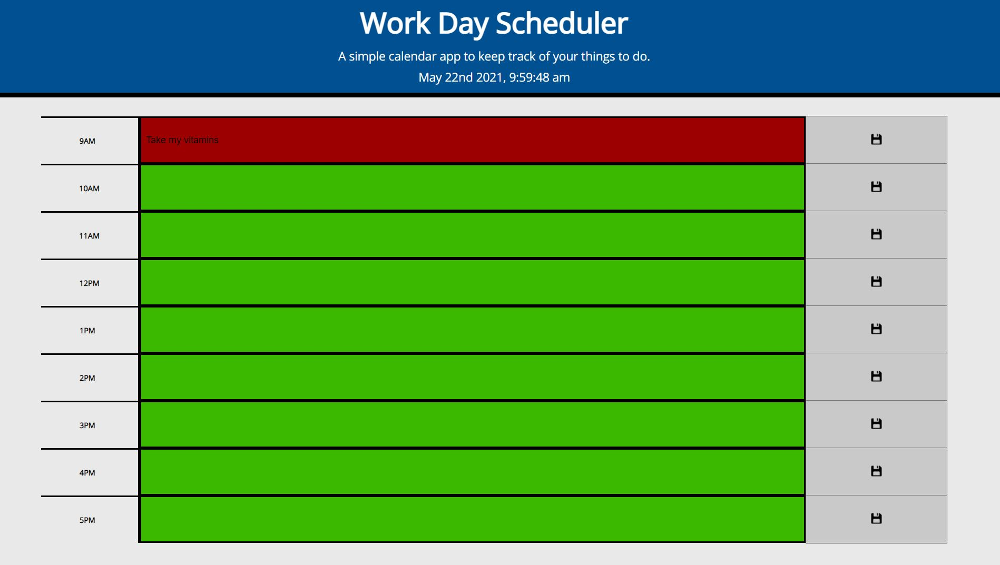

# Week5-WorkDay-CP
This is Corey Parker's Week 5 homework, Work Day Scheduler.

My biggest struggles/achievements were:

1. Getting line 67 of js to work and correctly pull the id into the loop as a string. 

2. On the css side, I had some trouble with scaling the To Do items at smaller sizes

3. Lines 33 - 45 took a bit of messing with to get a concise way of writing it. I started off by trying to individually assign each item the past, current, or future id. Eventually I got it working as a loop to dynamically assign the id.

4. I'm really happy with this project overall as I'm starting to feel more confident being able to write less code to perform the same function.

